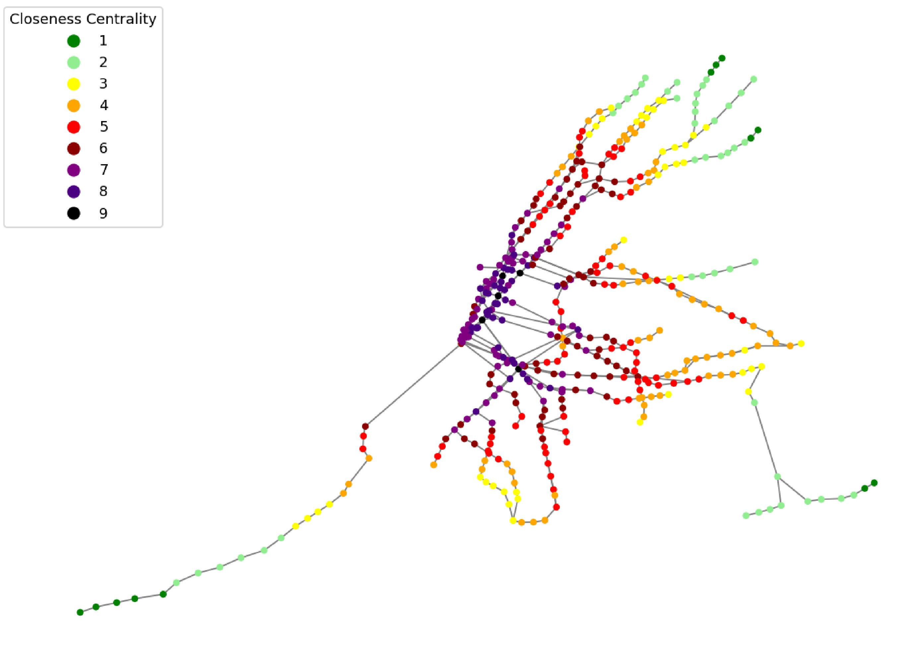

## Introduction

The New York City Metropolitan Transit Authority subway system is the largest transportation agency in North America, serving more than 3 million riders daily. In Manhattan, only 23.4\% of households own a car, making the borough highly dependent on the subway for transportation.

## Research Topic

Understanding that robust transportation infrastructure greatly influences urban landscapes, our study explores the impact of the MTA on public high school performance throughout Manhattan. Previous research has studied how subway centrality shapes various socioeconomic outcomes, such as job mobility, racial inequities, and housing prices. However, there is a lack of literature on the relationship between subway centrality and education quality. This gap is worth exploring because education quality has been linked to long-term educational attainment and higher valuations of neighborhoods. A more holistic understanding of how subway infrastructure affects these outcomes can inform school choice, and possibly contribute to urban planning decisions like deciding locations for new schools or where to extend subway lines. 

## Data Collection and Scraping
We drew from two major sources for our data collection:

MTA Subway Data, published by the MTA Open Data Program in 2023, included information about the name, geolocation, and subway lines running through each subway station.
NYC Public Schools Data, published by the NYC Department of Education for the 2022-23 school year, included performance metrics of each public school in Manhattan: Student Achievement, Rigorous Instruction, Collaborative Teachers, Supportive Environment, Effective School Leadership, Strong Family-Community Ties, and Trust.

Using the Python package NetworkX, we calculated centrality measures for each subway station and generated maps to visually represent the subway network. Then, we used Google Maps' API to calculate the geolocations for all high schools and subway stations, as well as to map each high school to its nearest subway station. At the conclusion of our data processing, we had obtained each school's performance metrics and its nearest subway station's centrality measures.

## Methodology

## Graph Theory

Graph theory enables complex network analysis. Node centrality is a critical concept in graph theory that indicates the importance of each node to the rest of the network. Treating each subway station as a node and the subway lines connecting subsequent stations as edges, we calculated four centrality measures for each Manhattan station based on the entire subway system: Node Degree, Closeness Centrality, Betweenness Centrality and Eigenvector Centrality.

## Multiple Linear Regression
Initially, we performed Multiple Linear Regression (MLR) to analyze the relationship between subway centrality and school performance. A separate linear regression was performed for each of the 7 performance metrics.

## Principal Component Analysis 
Principal Component Analysis (PCA) is a dimensionality reduction technique that identifies correlated variables and linearly combines them into new principal components. We ran PCA on 90 rows (high schools) and 11 columns (7 performance metrics and 4 centrality measures), resulting in three principal components:

Neighbor-driven Centrality: Node degree, eigenvector, and betweenness centrality, capturing 72.6% of total variance.
Performance Metrics: All seven performance metrics, capturing 9.12% of total variance.
Distance-driven Centrality: Closeness, betweenness, and eigenvector centrality, capturing 6.87% of total variance.

## K means clustering 
K-means clustering is an unsupervised machine learning algorithm that partitions a dataset into k clusters. Using the elbow method, we formed 3 clusters based on the centrality and performance metrics PCs. After clustering, we used the original centrality and performance data to run PCA on each set of schools to identify which components were most relevant.

## Results & Discussion
We conducted K-means clustering on both the neighbor-driven and distance-driven centrality PCs. The clusters fell into the same centrality-performance categories: high centrality–medium performance, low centrality–low performance, and low centrality–high performance. We analyzed these patterns further by performing PCA on the original data for each cluster.

Neighbor-driven Centrality Clusters:

Cluster 1: High centrality, medium performance, dominant metric: Rigorous Instruction
Cluster 2: Low centrality, low performance, dominant metric: Strong Family-Community Ties
Cluster 3: Low centrality, high performance, dominant metric: Student Achievement
Distance-driven Centrality Clusters:

Cluster 1: High centrality, medium performance, dominant metrics: Rigorous Instruction, Student Achievement
Cluster 2: Low centrality, low performance, dominant metric: Strong Family-Community Ties
Cluster 3: Low centrality, high performance, dominant metric: Student Achievement

## Conclusion
Although our data didn’t demonstrate the linear relationship we had initially hypothesized, using PCA and K-means clustering, we reached conclusions about centrality-performance relationships for Manhattan public high schools:

Neighbor-driven and distance-driven centrality PCs generated similar clusters, indicating that the clustering approach effectively captured centrality-performance patterns.
Schools associated with particularly high subway centrality did not achieve high performance, challenging our initial hypothesis.
Student Achievement is the most informative performance metric for school performance.

## Authors & contributors

The original setup of this repository is by:
- **Sandra Zelen** ([sz3120@columbia.edu](mailto:sz3120@columbia.edu))
- **Caroline Smyth** ([css2215@columbia.edu](mailto:css2215@columbia.edu))
- **Kathy Xu** ([kx2204@columbia.edu](mailto:kx2204@columbia.edu))

## Acknowledgements

This project was supported by the Columbia Summer Undergraduate Research Experiences in Mathematical Modeling. Special thanks to George Dragomir and Vihan Pandey for their invaluable guidance.
